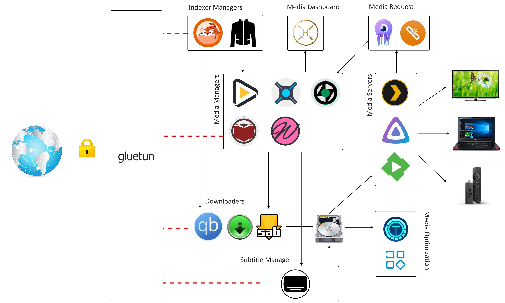

# Media Stack

Media-Stack is an automated, containerized media management system that orchestrates content discovery, downloading, organization, and streaming. Built using Docker Compose, it integrates powerful tools like Sonarr, Radarr, Lidarr, and Readarr for managing TV shows, movies, music, and books. It is paired with indexers and downloaders such as Prowlarr, qBittorrent, and SABnzbd, while Bazarr handles subtitle automation. Traffic is securely routed through Gluetun for VPN protection. The organized media is then served through Jellyfin or Plex, delivering Netflix-like streaming experience across all your devices.



## Disclaimer

This project is intended strictly for educational and informational purposes. It demonstrates how to automate the management, downloading, and streaming of digital media using open-source tools and containerized infrastructure. The techniques and software described herein have legitimate, legal uses, such as organizing personal media collections, downloading open-source content, or accessing public domain materials.

We do not condone or promote piracy in any form. This project does not encourage the downloading or distribution of copyrighted content without proper authorization. Users are solely responsible for how they configure and use the tools provided. You must adhere to your local laws and regulations regarding digital media, intellectual property, and copyright enforcement. The author assumes no liability for misuse, and any actions taken based on this project are done at your own risk. Please use this information responsibly and ethically.

## Architecture

### *Arr Stack

The ***Arr Stack** is a collection of open-source, self-hosted tools that work together to automate different aspect of media acquisition, management, and consumption. Originally popularized by `Sonarr` for TV shows, the stack has expanded into a modular ecosystem managing movies, music, books, and even adult content. Each app is responsible for a specific function in the pipeline from discovering and downloading media to organizing, enriching with metadata, downloading subtitles, and serving it through media servers like Plex or Jellyfin. These tools typically communicate via REST APIs, use indexers, and integrate with download clients.

### Media Managers

Media managers automate the acquisition and organization of your media content. Each application's name ends with "arr" a playful suffix that has become a naming convention within the community, originating from `Sonarr` (previously NZBDrone).

| App                                               | Year Introduced   | Description                             |
|---------------------------------------------------|-------------------|-----------------------------------------|
| [Sonarr](https://github.com/Sonarr/Sonarr)        | 2013              | Manages and organizes **TV shows**.     |
| [Radarr](https://github.com/Radarr/Radarr)        | 2016              | Manages and organizes **movies**.       |
| [Lidarr](https://github.com/Lidarr/Lidarr)        | 2017              | Manages and organizes **music**.        |
| [Readarr](https://github.com/Readarr/Readarr)     | 2021              | Manages eBooks and **comics**.          |
| [Whisparr](https://github.com/Whisparr/Whisparr)  | 2021              | Manages **adult** media collections.    |

- **Sonarr**: Sonarr focuses on TV shows, supporting both current and upcoming series. It tracks episodes, seasons, and air dates, fetches metadata, and automates the download process from indexers. It can upgrade low-quality releases (e.g., SD to 1080p) as better versions become available and ensures your TV library is always complete and cleanly structured.

- **Radarr**: Radarr is a movie automation and library manager. It monitors movie watch-lists or specific releases, fetches metadata (like posters, summaries, and ratings), and works with indexers and downloaders to automatically grab the best available versions. Once downloaded, Radarr renames and sorts files into your structured movie library, keeping everything organized and ready for playback in media servers.

- **Lidarr**: Lidarr is designed for music enthusiasts who want to automate building and maintaining a digital music library. It monitors artists and albums, fetches metadata (including album art, genres, and release info), and integrates with downloaders to obtain and organize audio files into your music folder.

- **Readarr**: Readarr brings automation to ebook and audiobook libraries. It supports various formats like EPUB, PDF, and MP3/M4B for audiobooks, and connects to indexers to track, download, and tag metadata for your reading collection, including author bios, cover images, and publishing details.

- **Whisparr**: Whisparr is a fork of Sonarr tailored to adult content. While experimental, it offers similar automation: managing metadata, downloading releases, organizing files, and integrating with the same tools as the rest of the stack. It helps maintain a separate, structured adult content library.

All of these applications are built primarily in C# using the .NET Core (now simply .NET) framework. This modern, cross-platform runtime allows them to run on Windows, Linux, and macOS. Each application exposes a RESTful API, which enables rich automation and integration with other components of the stack. The user interface is typically served as a web app, often using JavaScript frameworks like Vue.js for a responsive and interactive experience.

Media managers integrate with indexers and downloaders to automatically fetch content based on your preferences. Here is what normally happens:

- Sonarr → asks an "indexer manager" such as Prowlarr: "Hey, search for this episode."
- Prowlarr → searches all configured indexers.
- Prowlarr → returns list of results to Sonarr.
- Sonarr → selects best match and sends it to downloaders (qBittorrent or SABnzbd).
- qBittorrent/SABnzbd → downloads the file.
- Sonarr → watches download folder, renames/moves file, updates library.

### Indexers and Indexer Managers

Indexers are essential infrastructure in the *Arr ecosystem, functioning as searchable databases that aggregate metadata about media content such as movies, TV shows, music, and books. These services expose APIs that allow media managers like Sonarr, Radarr, Lidarr, or Readarr to search for specific titles, monitor for new releases, and fetch download links. Indexers typically fall into two categories: **torrent-based** indexers, which reference `.torrent` files or magnet links, and **Usenet-based** indexers, which point to `NZB` files for binary downloads from Usenet servers. Manually configuring each indexer in every media manager can become tedious and error-prone. That’s where indexer managers come in.

Initially, [Jackett](https://github.com/Jackett/Jackett) was the go-to indexer manager for torrent-based indexers. It acts as a proxy, translating the diverse APIs of hundreds of public and private torrent sites into a standardized Torznab-compatible interface. This allows *Arr applications to interact with a wide variety of indexers through a unified integration layer. Users can configure multiple torrent indexers, handle authentication, and execute consolidated searches all through Jackett. Despite its utility, Jackett is limited to torrent indexers and lacks full support for the broader *Arr ecosystem.

To overcome these limitations, [Prowlarr](https://github.com/Prowlarr/Prowlarr) was introduced as a modern, comprehensive indexer manager. Designed specifically for the *Arr suite, Prowlarr supports both torrent and Usenet indexers, offering features such as automatic indexer syncing across multiple media managers, a more intuitive web interface, better performance, and deep integration with Sonarr, Radarr, Lidarr, and Readarr. Prowlarr centralizes indexer configuration, eliminating redundancy and ensuring consistent behavior across the entire media automation workflow.

In short, while indexers supply searchable metadata, Jackett and Prowlarr serve as indexer managers. They are middleware that connects media managers to those indexers efficiently and scalably.

### Download Clients (Downloaders)

Download clients, often referred to as downloaders, are applications responsible for retrieving media files once a matching release is found by the *Arr media managers through indexers. These tools handle the actual transfer of data to your local system using either BitTorrent or Usenet protocols, depending on your setup.

For torrent-based workflows, popular clients include [qBittorrent](https://github.com/qbittorrent/qBittorrent), [Deluge](https://github.com/deluge-torrent/deluge), and [Transmission](https://github.com/transmission/transmission). These clients support advanced features like watch folders, categories, and web APIs, which allow Sonarr, Radarr, and other *Arr apps to automatically send download instructions, monitor progress, and organize completed downloads. It's important to distinguish between a torrent indexer and a torrent client. A torrent indexer provides searchable metadata and .torrent files or magnet links for available content, while a torrent client is responsible for downloading and managing that content via the BitTorrent protocol.

| **Component**               | **Role**                                                  | **Example**       |
|-----------------------------|-----------------------------------------------------------|-------------------|
| Torrent Indexer             | Catalogs and exposes metadata about shared torrents       | Internet Archive  |
| Torrent Client (Downloader) | Downloads and manages `.torrent` or magnet-based content  | qBittorrent       |

For Usenet-based workflows, tools like [NZBGet](https://github.com/nzbgetcom/nzbget) and [SABnzbd](https://github.com/sabnzbd/sabnzbd) are commonly used. They download content from Usenet servers using `.nzb` files provided by indexers. These clients also support automation features such as post-processing scripts, speed throttling, and automatic unpacking and repair of downloaded files. It's important to understand the distinction between a Usenet indexer, provider, and client. A Usenet indexer catalogs and provides access to metadata about content posted to Usenet. A Usenet provider (or server) hosts and serves the actual binary content. A Usenet client uses NZB files to connect to the provider and download, verify, and extract the content.

| **Component**               | **Role**                                             | **Example**      |
|-----------------------------|------------------------------------------------------|------------------|
| Usenet Indexer              | Catalogs available Usenet content (searchable)       | NZBGeek          |
| Usenet Provider (Server)    | Hosts and delivers actual Usenet content             | Newshosting      |
| Usenet Client (Downloader)  | Downloads, verifies, and extracts content via NZBs   | NZBGet, SABnzbd  |

### Subtitle Manager

A subtitle manager in the *Arr ecosystem is responsible for automatically downloading, organizing, and syncing subtitles for your media library. The most popular tool for this purpose is [Bazarr](https://github.com/morpheus65535/bazarr), which integrates with media managers like Sonarr and Radarr as well as media servers like Plex and Jellyfin.

Bazarr monitors your media library for missing or outdated subtitles and uses subtitle provider APIs (e.g., OpenSubtitles, Addic7ed, Subscene) to fetch the appropriate subtitle files in your preferred language(s). It supports multiple subtitle formats, language prioritization, automatic syncing, and version matching based on release names, ensuring compatibility between subtitles and your specific video files. By automating the subtitle acquisition process, a subtitle manager eliminates the need for manual downloads, reduces playback errors caused by mismatched files, and enhances the viewing experience especially in multilingual households or for the hearing-impaired. It plays a critical supporting role in a fully automated, user-friendly media workflow.

### VPN Gateway

A VPN gateway acts as a secure tunnel between your local network or Docker containers and a remote network or internet endpoint. When used in media automation environments (e.g., with torrent clients like qBittorrent), a VPN gateway helps preserve privacy, mask your public IP address, and bypass ISP throttling or geo-restrictions. It also ensures that even if a container initiates potentially sensitive outbound traffic (such as P2P torrenting), it is encrypted and routed safely through the VPN.

[Gluetun](https://github.com/qdm12/gluetun) is a lightweight, privacy-focused Docker container that functions as a VPN gateway for other containers. It supports popular [VPN providers](https://github.com/qdm12/gluetun-wiki/tree/main/setup/providers) and handles the VPN connection setup internally using OpenVPN or WireGuard. When Gluetun connects to the VPN, it establishes a `tun0` virtual interface, routing all network traffic through that encrypted tunnel. Example log from Gluetun showing tunnel initialization:

    2025-07-13T02:08:59-07:00 INFO [openvpn] TUN/TAP device tun0 opened
    2025-07-13T02:08:59-07:00 INFO [openvpn] /sbin/ip link set dev tun0 up mtu 1500
    2025-07-13T02:08:59-07:00 INFO [openvpn] /sbin/ip link set dev tun0 up
    2025-07-13T02:08:59-07:00 INFO [openvpn] /sbin/ip addr add dev tun0 10.74.0.19/16

When you configure a container with `network_mode: "service:gluetun"`, it joins the exact same network namespace as the Gluetun container. This means that:

- The service container does not have its own IP
- All inbound and outbound traffic goes through Gluetun
- Therefore, any incoming ports must be forwarded from the Gluetun container itself

Since the service container has no separate network stack, it can't bind to ports on the host by itself. Only Gluetun can. This means that you must expose any ports you want to access through Gluetun, not directly from the service container.

Only containers that need VPN protection should be routed through Gluetun. This includes all torrent and usenet downloaders. Media managers like Sonarr and Radarr don’t need VPN access themselves unless you specifically want to route all their indexer connections through the tunnel (we did include them in VPN connection). If you're using torrent clients through Gluetun, be sure to also configure killswitch, firewall, or leak protection features that Gluetun provides by default.

### Recovery of Unhealthy Containers

In Dockerized environments that rely on VPN-based networking (such as Gluetun + qBittorrent), maintaining connectivity and availability is critical especially when containers depend on external network health (e.g., VPN tunnels). One common issue is that a container may remain running from Docker’s perspective, even though it has lost network connectivity or is effectively non-functional. Docker's default restart policy (`unless-stopped`, `always`) does not handle this scenario gracefully.

This is where [qmcgaw/deunhealth](https://hub.docker.com/r/qmcgaw/deunhealth) comes in. It is a lightweight companion container designed to monitor the health of other containers and restart them if they become unhealthy, based on Docker healthchecks. It does this by inspecting Docker's health status via the Docker socket and issuing controlled restarts only when explicitly configured.

Our `qbittorrent` container has a custom healthcheck, which checks basic internet connectivity every 60 seconds. The label `deunhealth.restart.on.unhealthy=true` tells Deunhealth to monitor this container and restart it if the healthcheck fails consistently. If qBittorrent stalls due to a VPN timeout or DNS resolution failure, Deunhealth safely restarts the `qbittorrent` container. This helps resolve temporary VPN outages, route changes, or DNS failures without requiring full-stack restarts or manual debugging.

Recall that `qbittorrent` is running with `network_mode: service:gluetun`, all of its outbound traffic relies entirely on Gluetun's VPN connection. If Gluetun temporarily loses the VPN tunnel or changes endpoints (e.g., due to reconnection), the qBittorrent container may silently fail to resume proper operation. Docker won't notice, but your downloads will stall. Deunhealth ensures resilience by restarting only the affected dependent container (e.g., qBittorrent).

### Media Servers

Media servers are applications that organize, stream, and transcode media content such as movies, TV shows, music, and photos across devices on a local network or over the internet. They serve as the final layer in a fully automated media workflow, presenting a polished, user-friendly interface for browsing and playing back content that has been downloaded and managed by tools like Sonarr, Radarr, or Lidarr.

Two of the most widely used media servers are Plex and Jellyfin. Plex offers a polished cross-platform experience with optional remote access, mobile sync, and premium features through its subscription plan (Plex Pass). Jellyfin, on the other hand, is a fully open-source alternative with no locked features or cloud dependency, making it ideal for privacy-conscious users.

Media servers scan directories for media files, automatically fetch metadata (titles, posters, plot summaries), and group content into collections. They support multiple users, resume playback across devices, subtitle rendering, transcoding for different device capabilities, and integrations with clients like smart TVs, mobile apps, and web browsers.

In the *Arr ecosystem, once tools like Sonarr or Radarr download and organize media into structured folders, the media server picks up the new content and makes it available for streaming. This handoff ensures that media is always up to date, beautifully presented, and accessible from anywhere, transforming your server into a personal Netflix-like experience.

### Media Request Manager

[Jellyseerr](https://github.com/fallenbagel/jellyseerr) is a feature-rich media request management application, designed to integrate with Jellyfin, Plex, Emby and the broader Arr ecosystem (Sonarr, Radarr). Originally forked from [Overseerr](https://github.com/sct/overseerr), Jellyseerr extends its predecessor's capabilities by offering native Jellyfin support, enabling users to authenticate with their Jellyfin accounts and request media directly through an intuitive web interface. It retains full compatibility with Plex while enhancing flexibility for self-hosted users who prefer open-source streaming solutions. With support for multiple users, automated media downloads, and deep integration with Tautulli, Jellyseerr provides a centralized and extensible solution for managing and fulfilling media requests across diverse platforms.

### Media Dashboard

[Huntarr](https://github.com/plexguide/Huntarr.io) scans your existing *Arr libraries (Radarr, Sonarr, Lidarr) to find missing media or outdated releases. It also recommends upgrades based on quality settings or recent improvements, acting as a proactive librarian to keep your collection complete and high-quality.

### Media Optimization

Media Optimization refers to the automated process of analyzing, converting, and organizing digital media files (primarily video and audio) to improve storage efficiency, compatibility, and playback performance. This typically involves transcoding to more efficient codecs (e.g., H.264 to H.265), removing unnecessary audio or subtitle streams, standardizing file formats, renaming files based on metadata, and performing health checks to detect corruption. Tools like [Tdarr](https://github.com/HaveAGitGat/Tdarr) and [Unmanic](https://github.com/Unmanic/unmanic) support these tasks by providing rule-based workflows and user-friendly interfaces, making it easy to maintain a clean, consistent, and space-efficient media library for use with platforms like Plex or Jellyfin.

## Getting Started

Ensure the following directory structure is in place to organize media and downloads correctly:

```text
data/
├── media/
│   ├── tv_shows/       # Sonarr root folder
│   ├── movies/         # Radarr root folder
│   ├── music/          # Lidarr root folder
│   ├── ebooks/         # Readarr root folder
│   ├── adult/          # Whisparr root folder
│   ├── trailer/        # Trailarr root folder
│   └── youtube/
├── downloads/
│   ├── qbittorrent/
│   ├── nzbget/
│   └── sabnzbd/
```

Create these directories and set proper ownership:

    sudo mkdir -p data/{media/{tv_shows,movies,music,ebooks,adult,trailer,youtube},downloads/{qbittorrent,nzbget,sabnzbd}}
    sudo chown -R 1000:1000 /data

In the Docker Compose configuration, we assume `PUID=1000` and `PGID=1000`, which are common defaults for Linux users. You can confirm or change these using:

    id your_user

**Gluetun Setup**

Navigate to the [Gluetun provider](https://github.com/qdm12/gluetun-wiki/tree/main/setup/providers) setup guide and select your VPN provider. Create a `.env` file and populate it with the required environment variables for Gluetun, as specified for your provider.

Start all the containers in the background:

    docker compose up -d

Monitor Gluetun logs to confirm VPN connectivity:

    docker logs -f gluetun

Look for output like:

    2025-07-13T17:14:25-07:00 INFO [healthcheck] healthy!
    2025-07-13T17:14:25-07:00 INFO [ip getter] Public IP address is 146.70.172.22 (United States, California, Los Angeles - source: ipinfo)
    2025-07-13T17:14:31-07:00 INFO [dns] downloading hostnames and IP block lists
    2025-07-13T17:14:32-07:00 INFO [dns] DNS server listening on [::]:53
    2025-07-13T17:14:33-07:00 INFO [dns] ready

To verify IP routing from another container (e.g., qbittorrent):

    docker exec -it qbittorrent bash

Visit a service like https://ipinfo.io:

```text
# wget -qO- https://ipinfo.io

{
  "ip": "146.70.172.22",
  "city": "Los Angeles",
  "region": "California",
  "country": "US",
  "loc": "34.0443,-118.2509",
  "org": "AS9009 M247 Europe SRL",
  "postal": "90014",
  "timezone": "America/Los_Angeles",
  "readme": "https://ipinfo.io/missingauth"
}
```

**Web Interface Access**

You can access different services from:

| App          | URL to Access              |
|--------------|----------------------------|
| Sonarr       | `http://<host-ip>:8989`    |
| Radarr       | `http://<host-ip>:7878`    |
| Lidarr       | `http://<host-ip>:8686`    |
| Readarr      | `http://<host-ip>:8787`    |
| Whisparr     | `http://<host-ip>:6969`    |
|              |                            |
| qBittorrent  | `http://<host-ip>:8080`    |
| SABnzbd      | `http://<host-ip>:8085`    |
| NZBget       | `http://<host-ip>:6789`    |
|              |                            |
| Prowlarr     | `http://<host-ip>:9696`    |
| Jackett      | `http://<host-ip>:9117`    |
|              |                            |
| Bazarr       | `http://<host-ip>:6767`    |
| Jellyseerr   | `http://<host-ip>:5055`    |
|              |                            |
| Trailarr     | `http://<host-ip>:7889`    |
| Huntarr      | `http://<host-ip>:9705`    |
| Tdarr        | `http://<host-ip>:8265`    |

**Setting up Media Managers**

For each media manager (Sonarr, Radarr, Lidarr, Readarr, Whisparr):

1. Enable authentication:

    - Authentication Method: Forms (Login Page)
    - Authentication Required: Enabled

2. Set a username and password.

3. Go to Settings → Media Management → Root Folders and add the appropriate folder based on the `data/media/` structure described above.

**qBittorrent**

We are using qBittorrent as torrent download client.

Access the web interface using `admin` as username and password is randomly generated.

    docker logs qbittorrent

Retrieve the auto-generated password:

    A temporary password is provided for this session: xxxxx

Login and change your password. Go to "Tools | Options | WebUI | Authentication" and set new credentials.

Then go to "Tools | Options | Advanced", and set network interface to "tun0".

Login to each media manager (Sonarr, Radarr, Lidarr, Readarr, Whisparr), go to "Settings | Download Clients" and add qBittorrent.

**SABnzbd**

We are using SABnzbd as NewsNet download client.

Select Language as English and click on "Start wizard".

Fill in the information about your Usenet provider (server).

Click on "Test Server" to make sure everything looks good. Then click next.

Go to "Config | General | Security" and get API key.

Login to each media manager (Sonarr, Radarr, Lidarr, Readarr, Whisparr), go to "Settings | Download Clients" and add SABnzbd.

**Prowler**

Setup authentication like before.

Go to indexers and add one or more indexers.

Go to "Settings | Apps" and add applications that will intergarte with pralwer: sonarr, radarr, lidarr, readarr, whisparr,

You need API key for each media manager in order to add it into prowler.

To find the API key, login to each media manager web page, go to "Settings | General".

Once linked, indexers added in Prowlarr will automatically propagate to the media managers.

**Video Guides**

Explore the following setup tutorials for deeper configuration:

- [Radarr Setup](https://youtu.be/nICSZKfvvoo)
- [Sonarr Setup](https://youtu.be/TpyMUPaIWrg)
- [Bazarr Setup](https://youtu.be/8vZ95HOdT-I)
- [Overseerr Setup](https://youtu.be/TfuwG-OHccI)
- [Unmanic Setup](https://youtu.be/F5E8hjtfDbQ)
